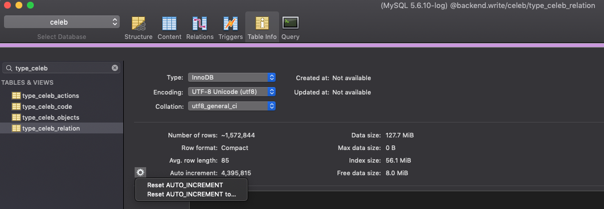

# 마이셀럽스 신규 개체 등록 방법
> Created: Nov 12, 2018 17:11 PM
>
> Author: Kyoong


## 🐣 신규 버티컬의 개체 추가 방법
---

**사용할 테이블**
- `type_celeb_relation`
- `{vertical}_data`

1. {vertical}_data 엑셀을 전달 받는다

2. type_celeb_relation 테이블에서 현재 마지막 cd_idx + 1 한 값을 복사한다

    ```sql
    SELECT `AUTO_INCREMENT`
    FROM INFORMATION_SCHEMA.TABLES
    WHERE TABLE_SCHEMA = 'celeb'
    AND TABLE_NAME = 'type_celeb_relation';
    ```

3. _data 엑셀에 cd_idx 컬럼을 만들고, cd_idx + 1 한 값을 맨 첫 행에 붙여 넣은뒤 연속 채우기를 한다

    

4. 마지막 행의 cd_idx 번호 +1 한 값을 sequel pro 에서 type_celeb_relation 테이블의 table info 탭에 가서 auto_increment 값을 변경한다
    
    **반드시 Reset AUTO_INCREMENT to... 를 선택하세요**
    

    **또는 쿼리로 하는 방법도 있습니다**
    ```sql
    ALTER TABLE celeb.type_celeb_relation AUTO_INCREMENT = {EXCEL에서 연속 채우기로 생성한 번호의 마지막 행의 값 + 1};
    ```

5. _data 테이블에 _data 엑셀 파일을 import 한다
    - 보통은 excel 파일을 **다른이름으로 저장 → csv(UTF-8)** 로 저장하고 CSV 파일을 import 합니다

6. _data 테이블의 값을 INSERT INTO ... SELECT 문으로 type_celeb_relation 테이블에 삽입한다

    ```sql
    INSERT INTO celeb.type_celeb_relation (cd_idx, cd_name, tcc_idx, cd_is_use, regist_date, update_date)
    SELECT cd_idx, {cd_name 또는 name 필드}, {tcc_idx}, 1, NOW(), NOW()
    FROM {vertical_data}
    WHERE cd_idx BETWEEN {최초 복사한 시작 cd_idx} AND {EXCEL에서 연속 채우기로 생성한 번호의 마지막 행의 값 + 1}
    ```