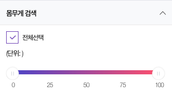

# 파인더 생성
> Created: Nov 23, 2018 13:30 PM
>
> Author: Kyoong

## Resources
---

🗂 Table: `celeb.bds_finder`, `celeb.bds_finder_items`

## Description
---

### 테이블 설명
---

#### TL;DR
1. `bds_finder` 는 하나의 파인더 모듈이며
2. `bds_finder_items` 는 `bds_finder` 의 버튼의 집합이다
3. `bds_finder` - `bds_finder_items` 는 **One to Many** 관계

#### celeb.bds_finder
---

위의 이미지는 아래의 `celeb.bds_finder` 하나의 row 와 대응됩니다

| bf_pk | bf_vertical | bf_type | bf_module_type | bf_name     | bf_field | bf_image | use_curation |
|-------|-------------|---------|----------------|-------------|----------|----------|--------------|
| 7     | celeb       | NULL    | finder_age     | 연령대 검색 | cd_age   | NULL     | 0            |

##### 컬럼별 설명
---

- bf_vertical → 버티컬 영문명
- bf_type → NULL or 'options'
    - **options** 타입의 경우는 디자인이 슬라이더 형태인 경우를 의미합니다
    
        
    
    - 그 외의 경우에는 **NULL** 입니다
- bf_module_type → 이 파인더 모듈의 영문 이름 입니다. 일반적으로 **finder_** 로 시작합니다
- bf_field → 이 모듈이 실제 **solr 에서 검색할 필드명을 입력**하시면 됩니다
    - 예: celeb 의 몸무게 검색의 경우 `rest_celeb_finder` 의 `cd_weight` 필드를 검색해야 함
- bf_image → 이 파인더에 필요한 이미지 주소(url)를 입력합니다. 현재까지는 사용한 적이 없습니다. 기본은 **NULL**로 합니다
- use_curation → 취향 큐레이터 사용여부(0:사용안함, 1:사용) 입니다만, 아직 사용한 적 없습니다. 기본은 **0**으로 합니다

- **👍 아마 다른 모듈들이 어떻게 기존에 입력되었는지 참고하시면, 금방 감 잡으실 수 있어요!**

#### celeb.bds_finder_items
---
