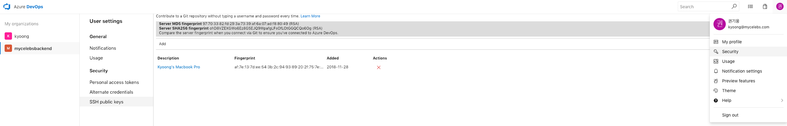
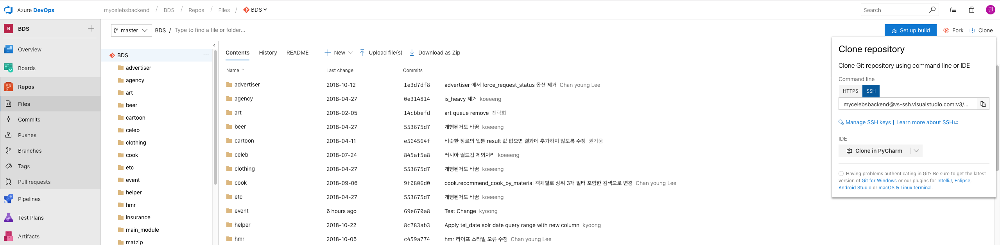

# 파인더 생성
> Created: Nov 28, 2018 14:00 PM
>
> Author: Kyoong

## ⭐️ References
---

일단 Git SSH 설정에 관한 좋은 글이 이미 너무 많기 때문에
아래 글을 먼저 참고하시는 편이 좋겠읍니다

1. [Adding a new SSH key to your GitHub account](https://goo.gl/py1ljM)
2. [Gitlab 공개키 등록하기](https://goo.gl/7GPKhW)
3. [Bitbucket 공개키 등록하기](https://confluence.atlassian.com/bitbucket/set-up-an-ssh-key-728138079.html)

## 🌊 Flow
---

1. `ssh-keygen` 명령어로 공개 키, 암호 키 쌍 생성, [(ssh-keygen에 대한 설명)](https://opentutorials.org/module/432/3742)
    ```bash
    # rsa 암호화 방식으로, 4096 비트의 암호 키, 공개 키 쌍을 생성함
    📦 v1.0.0 via 🍀 v8.12.0 on 🌵 master [⇡]
    in serverlessBDS 🐶 kyoong ✘ 1 λ ssh-keygen -t rsa -b 4096 -C "kyoong@mycelebs.com"
    Generating public/private rsa key pair.
    # 반드시 $HOME 의 .ssh 디렉토리에 생성하고, id_rsa 같이 기본으로 주어지는 이름은 덮어씌워질 위험이 있으니 이름을 별도로 지정한다
    Enter file in which to save the key (/Users/kyoong/.ssh/id_rsa): /Users/kyoong/.ssh/azure_test
    # passphrase 방식을 이용하지 않기 때문에 그냥 ENTER 를 입력하고 넘어감
    Enter passphrase (empty for no passphrase):
    # 마찬가지로, ENTER 를 입력하고 넘어감
    Enter same passphrase again:
    # 이 경로의 파일명이 암호키
    Your identification has been saved in /Users/kyoong/.ssh/azure_test.
    # 이 경로의 파일명이 공개키
    Your public key has been saved in /Users/kyoong/.ssh/azure_test.pub.
    The key fingerprint is:
    SHA256:vCAnik3YlVZAnRuAp40D/BAREHapEYZiahf6su+npjE kyoong@mycelebs.com
    The key's randomart image is:
    +---[RSA 4096]----+
    |*O=+=+..         |
    |*=oo.o+          |
    |+.*==  o         |
    |.*+=. ..         |
    |o =.o o S        |
    | = o + . .       |
    |.E=     .        |
    | .o. .           |
    | .=+o            |
    +----[SHA256]-----+
    ```

2. 생성된 공개키를 클립보드에 복사한다
    ```bash
    # MacOS 기준
    $ pbcopy < ~/.ssh/<YOUR_SSH_KEY_FILE_NAME>.pub 
    ```

3. 생성된 공개키를 `ssh-agent` 에 등록한다
    ```bash
    # MacOS Mojave 기준
    $ ssh-add -K <YOUR_SSH_PRIVATE_KEY_FILE_PATH>

    # 예시
    $ ssh-add -K $HOME/.ssh/azure_test # .pub 확장자인 공개키를 등록하면 안됩니다
    ```

3. Azure DevOps 에 공개키를 등록한다
    - https://mycelebsbackend.visualstudio.com/_usersSettings/keys
    
        - User settings → SSH Public Keys 선택 → Add 버튼 클릭
        - Description 에 적당한 설명을 입력하고, Key Data 에 복사된 공개키를 붙여넣음
        - Save 클릭

4. 로컬에 remote 저장소의 SSH 주소를 추가하고 `git pull` 명령어로 테스트 한다
    - Repos → Files → Clone → SSH
    

    ```bash
    📦 v1.0.0 via 🍀 v8.12.0 on 🌵 master [⇡]
    in serverlessBDS 🐶 kyoong ✘ 255 λ git remote add azure mycelebsbackend@vs-ssh.visualstudio.com:v3/mycelebsbackend/BDS/BDS

    $ git pull azure master # TEST
    ```


