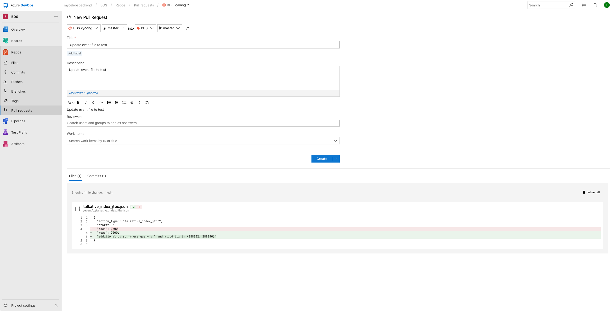

# 🐙 Mycelebs Backend Git work flow
> Created: Nov 29, 2018 11:00 PM
>
> Author: Kyoong

## ⭐️ References
---

1. [[우아한 형제들 기술 블로그] 우린 Git-flow를 사용하고 있어요](https://goo.gl/ad4frD)
2. [GitHub Standard Fork & Pull Request Workflow](https://goo.gl/XsX8ib)
3. [Best practice for tracking upstream in fork on github](https://goo.gl/uWj5He)

## 🌳 Abstract
---

Git과 원격 저장소 서비스(Gitlab, Azure DevOps...) 통한 협업을 하는 이유는...

- [x] 코드의 버전 관리
- [x] 공동 작업 프로젝트의 저장소
- [ ] 공동으로 운영하는 코드의 품질 관리 (이슈 트래킹, 코드리뷰 등)
- [ ] 원격 저장소 서비스의 CI/CD 파이프라인 활용

현재는 업무 여건상 (이라고 하는걸로 👌) 코드 리뷰 같은건 잘 진행하지 못하고 있는데요

**Upstream - Forked Private Repository** 형태로 변경하여

꼭 *Pull Request* 를 받아서 진행하는 방식으로 변경해보고자 합니다

### 🏗 Repository Structure
---
저장소의 전체 구조는 그림과 같은 형태로 유지하고자 합니다


## 🕵️‍♀️ How to
---

### 🎁 Prerequisite
---
1. Upstream 저장소를 Fork 한다
    - Repos → Files 화면에서 우측 상단에 Fork 버튼을 누르시면 됩니다
2. 로컬에 remote url 을 두 가지로 세팅한다
    
    ```bash
    $ git remote add upstream mycelebsbackend@vs-ssh.visualstudio.com:v3/mycelebsbackend/BDS/BDS
    $ git remote add origin mycelebsbackend@vs-ssh.visualstudio.com:v3/mycelebsbackend/BDS/BDS.kyoong
    $ git remote -v
    gitlab	http://devlab.celebtide.com:8081/dev/serverlessBDS.git (fetch)
    gitlab	http://devlab.celebtide.com:8081/dev/serverlessBDS.git (push)
    origin	mycelebsbackend@vs-ssh.visualstudio.com:v3/mycelebsbackend/BDS/BDS.kyoong (fetch)
    origin	mycelebsbackend@vs-ssh.visualstudio.com:v3/mycelebsbackend/BDS/BDS.kyoong (push)
    upstream	mycelebsbackend@vs-ssh.visualstudio.com:v3/mycelebsbackend/BDS/BDS (fetch)
    upstream	mycelebsbackend@vs-ssh.visualstudio.com:v3/mycelebsbackend/BDS/BDS (push)
    ```

### 🌊 Work Flow
1. 작업시작 전 백엔드 Azure DevOps 의 **WORK → Boards → Boards 에 작업을 추가**한다
    - 예를 들어, TV 버티컬의 basic_info 모듈 수정 작업이 있는경우 그 내용을 Boards 에 등록한다
2. 작업시작 전 · 후 **반드시 upstream 저장소를 pull 받는다**
    
    ```bash
    # 작업 시작 전, 후
    $ git pull upstream master
    ```
3. origin에 push 한 뒤에 upstream 에 Pull Request 보낸다
    
    ```bash
    # Push 전에도 꼭 upstream 을 한 번 받아봄
    $ git pull upstream master
    $ git push origin master
    ```
    → 이후 Azure DevOps 에서 Repos → Pull Request

## 🌊 Pull Request Flow
---

### 예시 화면



### 💻 What to do for Pull Request
---

1. **타이틀은 커밋 메시지와 동일하게 한다**
    - 커밋 메시지를 대충 작성하면 타이틀도 이상해 지겠죠? **커밋 메시지를 명확하게** 작성 해야겠습니다
2. Description 에는 상세 작업 내용을 남깁니다
    - 자유롭게. 쓸 얘기가 없다면 타이틀과 동일해도 무방합니다
3. [중요] Reviewers
    - **찬영님 또는 코드 리뷰를 할 수 있는 동료**를 지정합니다
    - 검색은 마이셀럽스 메일 주소로 검색할 수 있습니다
        - 동료의 마이셀럽스 메일 주소를 모른다면, 슬랙에서 프로필을 보면 알 수 있습니다
4. [중요] Work Items
    - 위의 Work Flow 의 1번 가이드를 따랐다면, Work Item 이 목록에 보일거에요
        - Active 상태인 Work Item 만 보입니다
    - Work Item 을 지정하고 Pull Request 를 하면 완료 상태로 변경됩니다
    - **요약하면, 할 일 티켓 발행 → 작업 → Pull Request 와 동시에 작업 종료 의 프로세스를 하고 싶은 겁니다**
