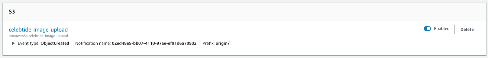

# 마이셀럽스 신규 개체 등록 방법
> Created: Nov 20, 2018 14:05 PM

## 📸 신규 개체의 이미지 업로드
---

### 참고할 프로젝트 
---
🦊 Gitlab - [mycelebsImageUpload](http://devlab.celebtide.com:8081/dev/mycelebsImageUpload/tree/master)

### 🏔 사용될 리소스
---
- `celeb.celeb_image_url`
    - 마이셀럽스 개체들의 이미지 주소가 저장된 테이블 입니다
- `AWS S3 - celebtide-image-upload`
    - 이 버킷에 이미지가 저장되면, image resizing 을 하는 람다가 트리거 됩니다
    - [이미지 리사이징 람다 함수](https://ap-northeast-1.console.aws.amazon.com/lambda/home?region=ap-northeast-1#/functions/MycelebsImageUpload-prod-resize?tab=graph)
    
- `AWS S3 - celebtide`
    - 실제 개체의 이미지가 저장되는 곳입니다
    - CF를 통해 `https://image.mycelebs.com/{vertical}/{image_size}/{cd_idx}_{image_size}_{sequence}.jpg`
    - 주소로 클라이언트에 제공됩니다
- `AWS SQS - mycelebs-image-upload`
    - 업로드 된 이미지가 celeb_image_url 데이터베이스에 삽입될 수 있도록, 대기 작업을 가지고 있는 Queue 입니다


### 🌊 Flow
---

1. `aws-cli` 를 이용해 이미지를 `celebtide-image-upload` 버킷에 올림
2. `celebtide-image-upload` 와 연결된 `MycelebsImageUpload-prod-resize` 람다 함수 트리거
3. MycelebsImageUpload-prod-resize(resize.py) 함수가 실행되면
    1. S3에 리사이징한 이미지를 업로드 하고
        - `celebtide/{vertical}/{image_size}/{cd_idx}_{image_size}_{sequence}.jpg` 형태로 저장함
    2. `mycelebs-image-upload` 큐에 처리 내용을 넣습니다
    3. `MycelebsImageUpload-prod-dataset` 함수(`dataset.py`)는 매 1분 마다 SQS에 메시지가 있는지 확인하고, 있다면 처리합니다
        - `MycelebsImageUpload-prod-dataset` 함수는 아침 7시 부터 저녁 9시 까지 매 1분 마다 실행됩니다
4. 저장된 S3 주소 정보를 `celeb.celeb_image_url` 테이블에 저장
5. 함수 종료

### 🏃‍♂️ aws-cli 설치 및 S3 버킷으로 업로드 실행
---

#### aws-cli 설치

```bash
$ python3 --version
Python 3.6.5

$ pip3 --version # 3.6과 pip가 연결 되어 있는지 확인합니다. 아니라면 WELCOME.md 를 참고해 파이썬을 설치하세요
pip 18.0 from /usr/local/lib/python3.6/site-packages/pip (python 3.6)

🌵 master [!?]
in welcome-backend-documents 🐶 kyoong λ pip3 install awscli
Requirement already satisfied: awscli in /usr/local/lib/python3.6/site-packages (1.16.14)
Requirement already satisfied: botocore==1.12.4 in /usr/local/lib/python3.6/site-packages (from awscli) (1.12.4)
Requirement already satisfied: rsa<=3.5.0,>=3.1.2 in /usr/local/lib/python3.6/site-packages (from awscli) (3.4.2)
Requirement already satisfied: colorama<=0.3.9,>=0.2.5 in /usr/local/lib/python3.6/site-packages (from awscli) (0.3.9)
Requirement already satisfied: s3transfer<0.2.0,>=0.1.12 in /usr/local/lib/python3.6/site-packages (from awscli) (0.1.13)
Requirement already satisfied: docutils>=0.10 in /usr/local/lib/python3.6/site-packages (from awscli) (0.14)
Requirement already satisfied: PyYAML<=3.13,>=3.10 in /usr/local/lib/python3.6/site-packages (from awscli) (3.13)
Requirement already satisfied: urllib3<1.24,>=1.20 in /usr/local/lib/python3.6/site-packages (from botocore==1.12.4->awscli) (1.23)
Requirement already satisfied: jmespath<1.0.0,>=0.7.1 in /usr/local/lib/python3.6/site-packages (from botocore==1.12.4->awscli) (0.9.3)
Requirement already satisfied: python-dateutil<3.0.0,>=2.1; python_version >= "2.7" in /usr/local/lib/python3.6/site-packages (from botocore==1.12.4->awscli) (2.7.3)
Requirement already satisfied: pyasn1>=0.1.3 in /usr/local/lib/python3.6/site-packages (from rsa<=3.5.0,>=3.1.2->awscli) (0.4.4)
Requirement already satisfied: six>=1.5 in /usr/local/lib/python3.6/site-packages (from python-dateutil<3.0.0,>=2.1; python_version >= "2.7"->botocore==1.12.4->awscli) (1.11.0)
```

#### 업로드 실행

```bash
$ aws s3 cp {이미지가 저장된 폴더} s3://celebtide-image-upload/origin/{버티컬 명} --recursive --include="*.jpg"

# 보통의 작업은 아래와 같이 합니다
# 담당자로부터 이미지 파일을 전달받아 Downloads 디렉토리에 저장했다고 가정
$ cd Downloads
$ cd ssgdfm_eye_images # 예시 디렉토리명 입니다
# 현재 디렉토리에 있는 모든 .jpg 확장자의 파일을 s3:// 이하 주소로 업로드 합니다
$ aws s3 cp . s3://celebtide-image-upload/origin/ssgdfm_eye --recursive --include="*.jpg" # 실행
```

#### Common Rules
1. **이미지는 반드시 jpg 파일 형식이어야 합니다** 
    - 담당자에게 필히 확인 받으세요
2. **파일 이름은...**

### 👀 이미지 정상 등록 확인

#### 데이터베이스에서 확인
celeb_image_url 테이블에 이미지가 잘 업로드 되었는지 확인합니다

하나의 개체는 4개의 행을 가집니다. 숫자를 확인해보시고 실패한 cd_idx 가 있다면 담당자에게 알려주세요
```sql
SELECT * FROM celeb_image_url WHERE cd_idx IN (...) -- 등록한 이미지와 디비에 들어간 이미지 수를 확인합니다.
```

#### 관리자에서 확인
[관리자](http://dev.mycelebs.com/donut/CelebImage/ShowList)에서 이미지가 정상적으로 나오는지 확인합니다

#### S3에서 확인
`celebtide/{vertical}/{image_size}/{cd_idx}.jpg` 형태로 저장되었는지 확인합니다

