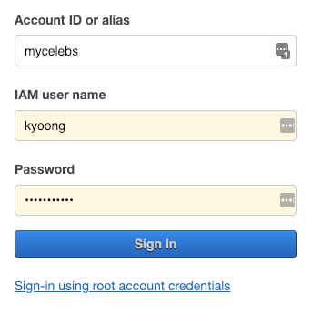

[Photo by rawpixel on Unsplash](https://unsplash.com/photos/lm6wcGMLaUM)

# 💖 Welcome Document

> Created: Nov 12, 2018 15:17 AM


## 🦊 Gitlab
---

[**http://devlab.celebtide.com:8081**](http://devlab.celebtide.com:8081)

1. Register 메뉴에서 신규 가입
2. Email Confirmation 기능이 동작하지 않으므로, **나재원** 님 또는 **조장완** 님께 가입 승인 요청
3. dev Group에 초대 요청을 **나재원** 님 또는 **조장완** 님께 요청


## 🌤 AWS
---

[**https://mycelebs.signin.aws.amazon.com/console**](https://mycelebs.signin.aws.amazon.com/console)

1. 계정 생성이 필요하므로, **나재원** 님 또는 **조장완** 님께 계정 생성 요청
2. 생성된 계정은 위 주소를 통해 접속
    1. 아마 첫 접속에 비밀번호 변경이 필요함
    2. 아래 이미지와 같은 창이 나오면, Account ID는 mycelebs 입니다

        

3. Region 은 도쿄와 서울을 사용중입니다
    1. ACM(Amazon Certificate Manager, SSL Cert) 만 CF 사용을 위해 Virginia 리전에 있습니다
    2. 마이셀럽스 데이터베이스는 대부분 **도쿄** 리전에 있습니다
        1. **서울** 리전에 있는 데이터 베이스 놀러, 메신저(봇신저), 데이터 팀용 테스트 DB, **익사이팅부킹닷컴**


## 🌈  Slack
---

[**https://dtide.slack.com**](https://dtide.slack.com)

사내 메신저는 공식적으로 **Slack** 을 사용합니다

1. **최재영** 님께서 보통 초대와 가입 방법에 대해 알려 주십니다
2. 개발팀이 사용 중인 채널은 공식적으로 **#dev** 채널이 있습니다
    1. 그 외 #bds-monitoring, #backend-notification(private) 정도가 있습니다
    2. #dev, #bds-monitoring 은 직접 참여가 가능하고, #backend-notification은 **이찬영** 님의 초대가 필요합니다


## 🏔 개발환경 (Backend Only)
---

대부분의 프로젝트 에서 **Python2, Python3** 를 사용합니다

일부 프로젝트는 **NodeJS** 를 사용합니다

형태소 분석과 관련된 프로젝트에서는 **Java** 를 사용합니다

Python 프로젝트는 [**Pipenv**](https://github.com/pypa/pipenv) 를 이용해 가상 환경에서 작업합니다

**❗️ pipenv 는 절대 homebrew 로 설치 하지 마시고, python 을 정상적으로 설치 하신 뒤 pip3 로 전역으로 설치하세요 ❗️**


### 💻 OSX 기준 Python 환경 설정
---

- 파이썬 설치는 **Homebrew** 를 통해 설치 하는 것을 권장합니다
    - 다만 아래와 같이, 설치할 경우 기본적으로 Python3.7 이 설치 되는데
    - 현재 AWS Lambda 의 런타임은 **Python3.6 까지만 지원**합니다
    - 따라서 아래와 같은 추가 작업이 필요합니다

```bash
$ brew install python
$ brew unlink python

# 강제로 파이썬 3.6.5_1 버전을 설치합니다
$ brew install https://raw.githubusercontent.com/Homebrew/homebrew-core/f2a764ef944b1080be64bd88dca9a1d80130c558/Formula/python.rb

$ brew switch python3.6.5_1

# 잘못된 symlink를 제거합니다
$ brew prune

$ python3 --version
Python 3.6.5

$ pip3 --version
pip 18.0 from /usr/local/lib/python3.6/site-packages/pip (python 3.6)

# 만약 pip3 의 버전이 18.1 이라면 18.0 으로 다운그레이드 해야 합니다 (pipenv에서 18.1 미지원)
$ pip3 install pip==18.0

$ pip3 --version
pip 18.0 from /usr/local/lib/python3.6/site-packages/pip (python 3.6)

# 이후 pipenv 를 설치합니다
$ pip3 install pipenv #  전역 설치
```

- 위와 같이 파이썬 설치를 완료했다면 Gitlab 에서 파이썬 프로젝트를 Clone 하여 로컬에 설치하고 `pipenv shell` 명령어가 잘 작동하는지 확인합니다
- 마찬가지로, pipenv shell 을 그냥 할 경우 pip의 버전이 18.1 로 설치되는 경우가 있기 때문에 18.0 으로 다운그레이드 해줍니다

```bash
$ pipenv shell

(serverlessBdsS3Sync-Ex7GHdd-) $ pip --version
pip 18.1 from /usr/local/lib/python3.6/site-packages/pip (python 3.6)

(serverlessBdsS3Sync-Ex7GHdd-) $ pip install pip==18.0

(serverlessBdsS3Sync-Ex7GHdd-) $ pip --version
pip 18.0 from /usr/local/lib/python3.6/site-packages/pip (python 3.6)
```

- pipenv 사용 법에 대해 [문서를 보고](https://github.com/pypa/pipenv) (길지 않으니) 익혀 두시면 좋습니다
- 마이셀럽스 자체 패키지 설치의 경우 requirements.txt 파일에 패키지 설치 경로가 명시 되어 있는데 #egg 정보가 있는지 확인이 필요합니다

```bash
# requirements.txt
git+http://devlab.celebtide.com:8081/dev/mycelebsLambdaPythonUtils.git#egg=mycelebsLambdaPythonUtils
git+http://devlab.celebtide.com:8081/dev/mycelebsPythonConfig.git#egg=mycelebsPythonConfig

# 만약 위 처럼 #egg=[패키지명] 값이 없다면, pipenv install 할 때 오류가 발생합니다. 꼭 표시해 주세요
```


### 🐍 Python Coding Convention
---

- **기본적인 코딩 스타일을 준수**합니다 (snake_case, PascalCase)
- 그 외 강요되는 코딩 스타일은 없지만, 변수 이름으로 어떠한 값일지 **유추하기 힘든 변수명 사용은 지양**합니다

```python
for r in self.aurora_cursor:
    r['cd_idx'] # r 이 뭐지...
```

위와 같은 변수명은 유추가 힘든것도 있지만 **변수명을 리팩토링 할 때 (찾아 바꾸기) 힘듭니다** 😭
- VSCode 기준 python linting option

```json
{
    "python.linting.enabled": true,
    "python.linting.pep8Enabled": true,
    "python.linting.pep8Args": [
        "--ignore=E402,E501,C0111,W0614"
    ],
    "python.linting.pylintArgs": [
        "--ignore=C0103,C0111,C1001,R0903"
    ],
}
```


### 📝 Editor or IDE
---

강요되는 툴은 없습니다. Coding Convention 만 지켜주세요

**PyCharm** 또는 **IntelliJ** 는 요청하시면 라이센스 구매 해 드립니다

(대부분은 Sublime Text, Visual Studio Code를 사용하고 계십니다)


## 👨‍👩‍👧‍👧  Companies
---

- **나재원** 님: 팀장님
- **전락희** 님: 백엔드 개발
- **조장완** 님: 백엔드 개발
- **이찬영** 님: 백엔드 개발
- **노현준** 님: 백엔드 개발
- **나경원** 님: 백엔드 개발
- **장지은** 님: 백엔드 개발
- **권기웅** 님: 백엔드 개발 (이 문서 작성자)
- **손연수** 님: 프론트엔드 개발
- **정명학** 님: 프론트엔드 개발 선임
- **박경두** 님: 프론트엔드 개발
- **안병은** 님: 프론트엔드 개발
- **이호성** 님: iOS 개발
- **임동민** 님: iOS 개발
- **오재호** 님: AOS 개발
- **김상집** 님: AOS 개발